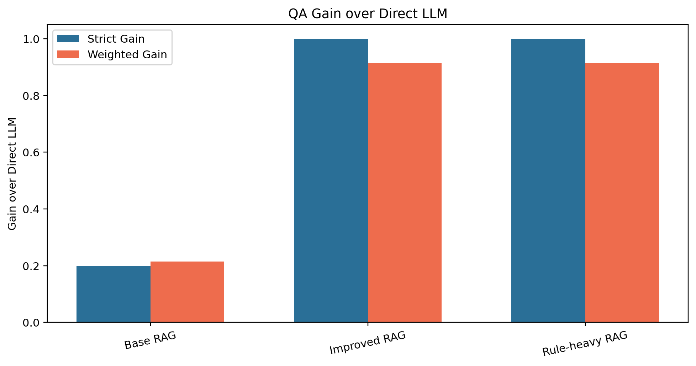
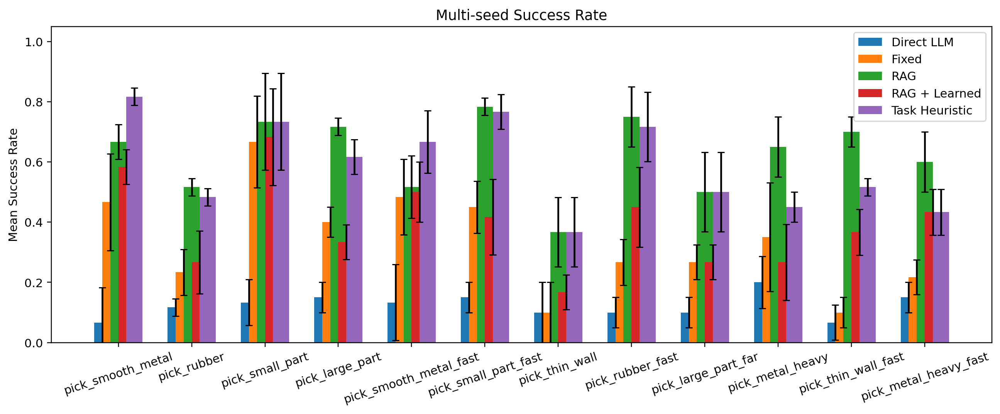
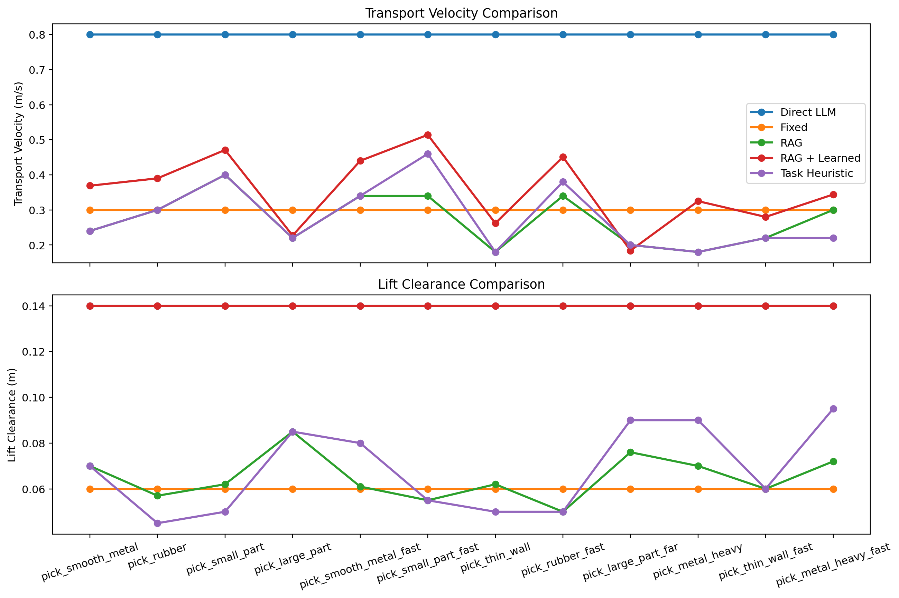
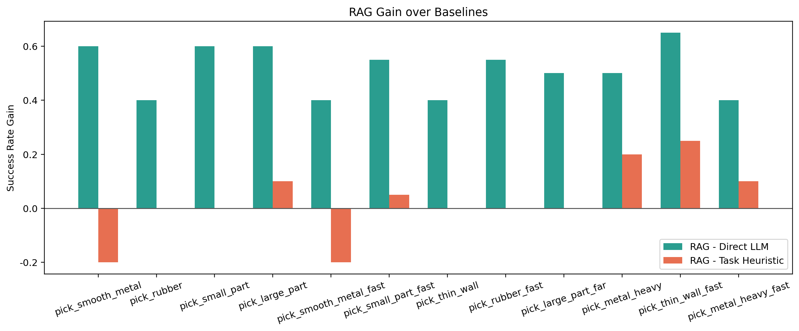

# MechanicalRag

面向机械工程与具身智能场景的知识增强问答与抓取仿真项目。

这个仓库现在按“核心代码 / 文档 / 输出 / 归档”分层组织，主线是两个问题：

1. 给定机械知识库与问题描述，系统能否稳定检索证据并在证据约束下回答问题。
2. 给定机械知识库与抓取任务描述，系统能否产出可执行控制参数，并在独立仿真环境中接受验证。

## 当前主线状态

截至 `2026-04-24 UTC`，当前主线目录是 `outputs/current`，对应 `round19`。

- 主线目录：`outputs/current/`
- round20 实验目录：`outputs/current_round20_sim/`
- round20 主要处理 `pick_large_part_far` 的 `placement_settle`。该实验降低了 `placement_settle_risk`。总体成功率低于 `round19`，主线结果保持不变。
- 当前关键结论：
  - `pick_large_part_far` 在主线中为 `0.6500 ± 0.1323`，主导失败模式为 `placement_settle_fail`
  - `pick_smooth_metal_fast` 在主线中为 `0.8167 ± 0.0289`
- 当前代码语义已对齐到 `round19` 主线。`placement_precision` 只保留在 `round20` 实验输出中。

如果只想看最终有效结论，优先看：

- [docs/overview.md](docs/overview.md)
- [simulation/README.md](simulation/README.md)
- [simulation_benchmark_result.json](outputs/current/simulation_benchmark_result.json)
- [showcase_summary.txt](outputs/current/showcase_summary.txt)

## 迭代说明

本项目的完善过程按轮次持续推进。下面保留两层说明：

- 分阶段摘要：便于先看整个项目是怎么一步步加厚的。
- 轮次索引：便于按 round 追溯每一轮具体处理了什么。

### 基础阶段

- `round2-round5`：完成 QA 评测口径和 simulation 对比口径的基础建设。这个阶段补齐了语义/数值/流程混合评分、unsupported 与 abstain、counterfactual 证据依赖评测、扩展 benchmark 任务集、`challenge_tags`、独立 learned baseline、结构化 evidence trace、evidence ablation 与 motion ablation。
- `round6-round7`：继续处理重载高速 motion 聚合和复杂任务检索优先级。这个阶段修正了 `pick_metal_heavy_fast` 的 motion 失配，也让 `高速/长距离` 相关证据更稳定地进入检索结果。

### 定向补强阶段

- `round8`：定向处理 `pick_smooth_metal_fast` 和 `pick_large_part_far`。`pick_smooth_metal_fast` 提升到 `66.67%±10.41%`，`pick_large_part_far` 提升到 `53.33%±10.41%`。这一轮确认了夹持力上限、长距离搬运净空收紧和运动相关力值补偿这条方向。
- `round9`：集中处理 `pick_thin_wall`。成功率从 `36.67%±11.55%` 提升到 `73.33%±5.77%`。这一轮解决了夹持力偏低和支撑语义映射问题。
- `round10`：集中处理低速材料带宽问题。`pick_rubber` 从 `51.67%±2.89%` 提升到 `81.67%±10.41%`，`pick_smooth_metal` 从 `66.67%±5.77%` 提升到 `81.67%±2.89%`。
- `round11`：补做动态力值中心校准。重点任务是 `pick_smooth_metal_fast`、`pick_metal_heavy`、`pick_large_part_far`。这一轮把高负载和高速场景的力值中心校准到更合理的区间。
- `round12`：补大件任务的对象特定证据。`pick_large_part_far` 和 `pick_large_part` 开始稳定命中大型零件对应的力值条目，控制器也开始更明确地使用这类证据。

### 长距离搬运链路

- `round13`：把长距离搬运里的数值运动条目落成可执行计划。控制器开始解析 `0.18-0.22m/s`、`0.07m`、`0.08m左右` 这类条目，环境侧加入 `transfer_sway_risk`。
- `round14`：为 `pick_large_part_far` 建立分阶段失败模型。失败桶拆成 `lift_hold_fail / transfer_sway_fail / placement_settle_fail`，风险输出也按阶段拆分。
- `round15`：补显式 `placement_velocity`，把末段落位速度从隐含变量变成可见控制项。
- `round16`：补高速低摩擦运输模式。`pick_smooth_metal_fast` 提升到 `81.67%±2.89%`，并开始稳定输出 `transfer_force=36N`、`placement_velocity=0.30m/s`、`lift_clearance=0.065m`。
- `round17`：补显式 `transfer_alignment`。`pick_large_part_far` 提升到 `63.33%±7.64%`，`avg_transfer_sway_risk_mean` 降到 `0.0153`。
- `round18`：验证 `clearance window` 方向。局部 sweep 有改善，正式 multi-seed benchmark 没有超过上一轮。这一轮保留在实验目录中。
- `round19`：补显式 `lift_force`。`pick_large_part_far` 提升到 `65.00%±13.23%`，`avg_lift_hold_risk_mean` 从 `0.0235` 降到 `0.0097`。当前主线来自这一轮。
- `round20`：继续处理 `pick_large_part_far` 的 `placement_settle`，新增 placement-stage `placement_precision` 实验链。`placement_settle_risk` 有下降，总成功率降到 `0.5833±0.0577`。这一轮保留在实验目录中。

### 轮次索引

| 轮次 | 主要处理内容 | 结果 |
| --- | --- | --- |
| round2 | 补 QA 混合评分、扩 benchmark 任务集、引入独立 learned baseline | 建立后续评测与对比口径 |
| round3 | 补 unsupported / abstain 评测，加入结构化 evidence trace | QA 和控制链开始能解释“为什么答、为什么这样控” |
| round4 | 补 counterfactual QA 与 simulation evidence ablation | 证据依赖关系开始可验证 |
| round5 | 修残余 QA 误判，补 motion ablation | 基础评测链更加完整 |
| round6 | 定向处理 `pick_metal_heavy_fast` 的 motion 失配 | 避免过高净空和路径长度把力值需求抬高 |
| round7 | 修 query 扩展截断问题 | `高速/长距离` 证据更稳定地进入检索结果 |
| round8 | 首次联合补强 `pick_smooth_metal_fast` 和 `pick_large_part_far` | 两个核心场景都出现第一轮稳定提升 |
| round9 | 集中处理 `pick_thin_wall` | 成功率从 `36.67%±11.55%` 提升到 `73.33%±5.77%` |
| round10 | 集中处理 `pick_rubber` 和 `pick_smooth_metal` | 两个低速材料任务都提升到 `81.67%` 左右 |
| round11 | 做动态力值中心校准 | 高负载和高速场景的力值中心更合理 |
| round12 | 补大型零件对象特定证据 | `pick_large_part_far` 开始稳定命中大型零件对应的力值证据 |
| round13 | 把长距离搬运数值条目转成可执行计划 | 新增 `transfer_sway_risk`，开始显式建模长距离搬运风险 |
| round14 | 建立分阶段失败模型 | 失败桶拆成 `lift_hold`、`transfer_sway`、`placement_settle` |
| round15 | 补显式 `placement_velocity` | 末段落位从隐含行为变成可见控制项 |
| round16 | 补高速低摩擦运输模式，主攻 `pick_smooth_metal_fast` | `pick_smooth_metal_fast` 提升到 `81.67%±2.89%` |
| round17 | 补显式 `transfer_alignment`，主攻 `pick_large_part_far` | `pick_large_part_far` 提升到 `63.33%±7.64%`，运输摆动风险下降 |
| round18 | 验证 `clearance window` | 定向 sweep 有改善，正式 multi-seed 未超过 `round17` |
| round19 | 补显式 `lift_force`，继续主攻 `pick_large_part_far` | `pick_large_part_far` 提升到 `65.00%±13.23%`，形成当前主线 |
| round20 | 实验 `placement_precision`，继续处理 `placement_settle` | `placement_settle_risk` 下降，总成功率回落到 `0.5833±0.0577`，保留为实验目录 |

## 主入口

- 综合说明：[docs/overview.md](docs/overview.md)
- 设计文档：[docs/DESIGN.md](docs/DESIGN.md)
- 仿真说明：[simulation/README.md](simulation/README.md)
- 一键运行：`bash scripts/run_all.sh`

## 当前结构

```text
MechanicalRag/
├── README.md
├── requirements.txt
├── mechanical_data.txt
├── chroma_compat.py
├── llm_loader.py
├── model_provider.py
├── qa/
├── simulation/
├── reporting/
├── scripts/
├── docs/
├── outputs/
└── archive/
```

目录职责：

- `qa/`：统一 QA 内核、数据集与评测。
- `simulation/`：控制器、环境、runner、CLI。
- `reporting/`：图表与摘要生成。
- `scripts/`：环境测试、模型下载、一键运行脚本。
- `outputs/`：当前运行结果与图表。
- `archive/`：历史复现快照与旧文档。

## 环境准备

```bash
python -m venv venv --system-site-packages
source venv/bin/activate
pip install -r requirements.txt
python scripts/download_models.py
```

当前默认模型：

- 生成模型：`Qwen/Qwen2-0.5B-Instruct`
- 向量模型：`sentence-transformers/all-MiniLM-L6-v2`

环境自检：

```bash
python scripts/env_test.py
```

## 运行方式

完整流程：

```bash
bash scripts/run_all.sh
```

分步运行：

```bash
source venv/bin/activate
python -m qa.evaluation --data_path mechanical_data.txt --case_set full --output_dir outputs/current
python -m simulation.benchmark --report_multi_seed --method rag --n_trials 20 --seeds 42 43 44 --output outputs/current/simulation_benchmark_result.json
python -m simulation.benchmark --compare_direct_llm --n_trials 20 --output_dir outputs/current
python -m simulation.benchmark --compare_evidence_ablation --n_trials 20 --seeds 42 43 44 --output_dir outputs/current
python -m simulation.benchmark --compare_motion_ablation --n_trials 20 --seeds 42 43 44 --output_dir outputs/current
python -m simulation.benchmark --compare_multi_seed --n_trials 20 --seeds 42 43 44 --multi_seed_methods rag rag_learned task_heuristic direct_llm fixed --output_dir outputs/current
python reporting/visualize_results.py --qa_json outputs/current/qa_evaluation_detail.json --sim_json outputs/current/simulation_comparison_rag_vs_baseline.json --sim_multi_seed_json outputs/current/simulation_comparison_multi_seed.json --output_dir outputs/visualizations
python reporting/generate_showcase.py --qa_json outputs/current/qa_evaluation_detail.json --sim_json outputs/current/simulation_comparison_rag_vs_baseline.json --sim_multi_seed_json outputs/current/simulation_comparison_multi_seed.json --sim_benchmark_json outputs/current/simulation_benchmark_result.json --output outputs/current/showcase_summary.txt
```

## 关键输出

- 主线 benchmark：
  `outputs/current/simulation_benchmark_result.json`
- 主线摘要：
  `outputs/current/showcase_summary.txt`
- round20 实验 benchmark：
  `outputs/current_round20_sim/simulation_benchmark_result.json`
- round20 实验摘要：
  `outputs/current_round20_sim/showcase_summary.txt`
- `outputs/current/qa_evaluation_detail.json`
- `outputs/current/rag_evaluation_report.txt`
- `outputs/current/rag_problems.txt`
- `outputs/current/direct_llm_result.txt`
- `outputs/current/problem_solving_result.txt`
- `outputs/current/simulation_benchmark_result.json`
- `outputs/current/simulation_comparison_rag_vs_baseline.json`
- `outputs/current/simulation_comparison_multi_seed.json`
- `outputs/current/simulation_evidence_ablation.json`
- `outputs/current/simulation_evidence_dependence_summary.txt`
- `outputs/current/simulation_motion_ablation.json`
- `outputs/current/simulation_motion_dependence_summary.txt`
- `outputs/current/simulation_split_summary.txt`
- `outputs/current/simulation_challenge_summary.txt`
- `outputs/current/showcase_summary.txt`
- `outputs/visualizations/`

## 结果图示

下面的图直接引用当前 `outputs/visualizations/` 中已经生成的结果图。

QA 方法汇总：

这张图汇总了各个 QA 方法在当前评测集上的整体表现，适合先看方法之间的总体差距。
阅读时可以重点看 `improved_rag`、`problem_solving_rag`、`direct_llm` 三组结果，快速判断检索增强和规则补强带来的提升幅度。


QA 相对 Direct LLM 的增益：

这张图把各个 QA 方法相对 `Direct LLM` 的提升单独拉出来展示，便于看增益是否稳定。
如果某个方法在主汇总图里看起来接近，这张图通常更容易看出相对优势的大小。



Simulation 多 seed 成功率：

这张图展示仿真 benchmark 在多 seed 设置下的成功率分布，是主线结果最直接的图形摘要。
阅读时可以重点看 `pick_large_part_far` 和 `pick_smooth_metal_fast` 两个任务，它们对应当前项目中最核心的动态搬运场景。



Simulation 控制计划对比：

这张图对比不同任务上的控制计划参数，包括夹持力、运输速度、末段落位速度和抬升净空。
它适合用来观察控制器有没有学到任务差异，例如长距离大件任务会出现更高的 `lift_force`、更低的 `placement_velocity` 和更明确的阶段化控制。



Simulation 成功率增益：

这张图展示 RAG 控制器相对基线方法的成功率提升，适合配合 benchmark JSON 一起看。
如果某个任务的总体成功率已经较高，这张图仍然能帮助判断当前方法是否保留了稳定的相对优势。



## 对比口径

- QA 评测统一运行在同一知识库、同一 split 和同一评分规则上，并输出词面命中、语义相似、数值一致性、流程顺序、拒答行为与证据命中分离统计；当前 split 已包含 `counterfactual`，可验证“原题可答、移除关键条目后应拒答”的翻转行为。
- simulation 对比统一使用同一任务集、同一 trial/seed 预算和同一环境判定逻辑；`reference_force_range` 只用于结果分析，不会作为控制器输入。
- simulation 现在比较的是八参数控制计划：`gripper_force`、`lift_force`、`transfer_force`、`transfer_alignment`、`approach_height`、`transport_velocity`、`placement_velocity`、`lift_clearance`；其中 `lift_force`、`transfer_force`、`transfer_alignment` 与 `placement_velocity` 分别承担起吊保持、运输夹持余量、重心对中和末段落位控制，不等于简单重复记录静态夹持力或运输速度。
- simulation 结果除成功率外还输出 95% CI、多 seed `mean±std`、按 `train/val/test` 聚合的 split 汇总、按 `challenge_tags` 聚合的 challenge 汇总、证据支持度/冲突统计、距离误差与稳定度/速度/净空风险指标。
- simulation 额外提供 `rag` 对 `rag_generic_only` 的 evidence ablation：同一检索证据下压制对象特定 force rule，用于验证增益是否真来自对象特定规则而不是泛化启发式。
- simulation 还提供 `rag` 对 `rag_no_motion_rules` 的 motion ablation：关闭 motion / clearance 路径并回退到中性运动默认值，用于验证速度/净空/接近高度规划是否真正贡献成功率。

## 当前限制

- QA 结果应解释为“当前知识库 + 当前 split 划分”上的结果，而不是开放域强泛化证明。
- QA 现在包含 `ood` 与 `counterfactual` split；其中 `counterfactual` 是条目级证据移除评测，能证明源依赖，但仍不等同于真实开放环境下的文档缺失分布。
- QA 拒答阈值仍是工程规则，不等同于完整校准过的 uncertainty estimation。
- 仿真 benchmark 的成功判定现在基于物体属性和执行观测独立建模；`reference_force_range` 只保留为分析指标，不再参与环境判定。
- `rag_learned` 现在使用环境 teacher 标签而不是 RAG 银标，但仍然只是轻量学习基线，不代表完整学习控制器。
- simulation evidence ablation 现在能证明对象特定 force rule 的贡献，但还没有覆盖更细粒度的运动学/接触规则删减实验。
- simulation 当前主线是 `round19`。`round20` 是实验轮次，内容是 `pick_large_part_far` 的 placement-stage `placement_precision` 控制。该实验的 authoritative benchmark 为 `0.5833 ± 0.0577`，低于 `round19` 的 `0.6500 ± 0.1323`。当前仓库主线与 `outputs/current` 一致，`pick_large_part_far` 的有效控制链仍是 `lift_force + transfer_force + transfer_alignment + placement_velocity`。
- complex task query 扩展已按动态优先级重排，`高速/长距离` 查询不会再被材料类通用查询截断掉。
- surrogate benchmark 现在会按 `seed + task_id` 固定随机序列；重复运行相同命令时，multi-seed JSON 应保持一致。
- 新增的多阶段控制计划仍是简化控制抽象，不等价于完整机器人轨迹优化与接触控制栈。

## 备注

- 若需要回退到 Hugging Face，可设置 `MODEL_PROVIDER=huggingface`。
- 若本机没有 MuJoCo，`simulation.benchmark` 会回退到环境代理模型，流程仍可执行。 
