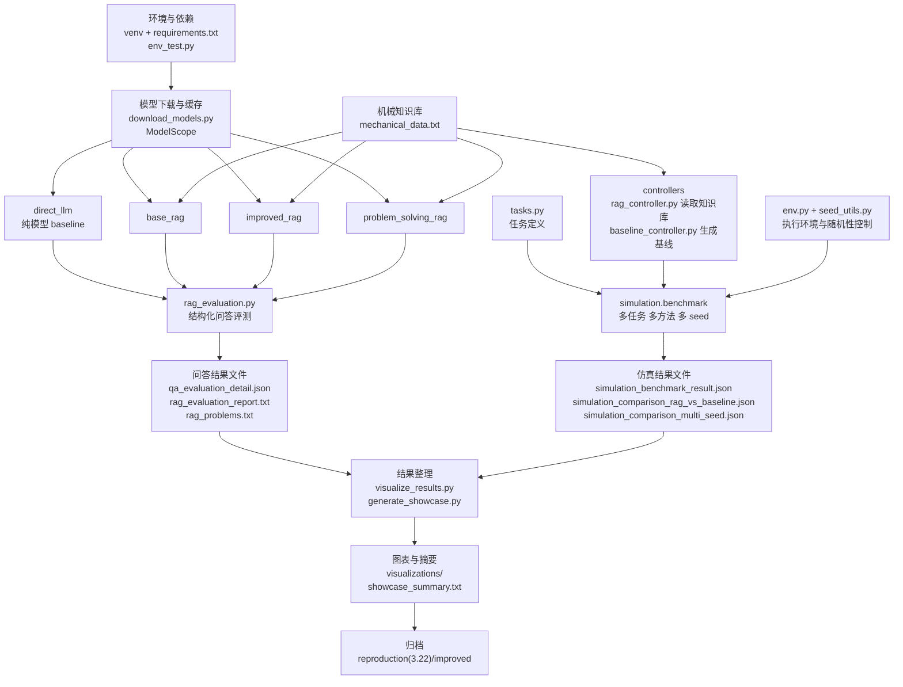

**Mechanical Embodied RAG Project**

这是一个面向机械工程与具身智能场景的 RAG 项目。当前版本已经覆盖问答对比、仿真 benchmark、多 seed 统计、图表生成和展示摘要，适合做课程作业、复现报告和答辩展示。

**1. 更新后主链路**

下面这张 Mermaid 流程图概括了当前版本的完整流程。



可以直接把它理解成四层：

- 第一层是公共基础，包括环境、模型下载和机械知识库
- 第二层分成两条主线，左侧是一条纯模型 baseline 和三条基于知识库的问答链路，右侧是仿真控制与 benchmark 对比
- 第三层是结果整理，统一生成图表和展示摘要
- 第四层是归档，方便把当前批次结果同步到 `reproduction(3.22)/improved`

`run_all.sh` 就是按这张图的顺序把各模块串起来。这样组织之后，问答结果、仿真结果、图表和汇报材料都来自同一批数据，复现和展示会更稳定。

**2. 当前包含的能力**

- `direct_llm`、`base_rag`、`improved_rag`、`problem_solving_rag` 四条问答链路
- `rag`、`direct_llm`、`fixed` 三种仿真方法对比
- `simulation_benchmark_result.json` 的多 seed 汇总结果
- `visualizations/` 下 15 张图表
- `showcase_summary.txt` 展示摘要

**3. 环境准备**

建议在项目根目录使用虚拟环境：

```bash
python -m venv venv
source venv/bin/activate
pip install -r requirements.txt
```

模型默认通过 ModelScope 下载，并缓存在 `.modelscope_cache/`：

```bash
python download_models.py
python download_models.py --with_flan
```

默认模型：

- 生成模型：`Qwen/Qwen2-0.5B-Instruct`
- 向量模型：`sentence-transformers/all-MiniLM-L6-v2`

**4. 推荐运行方式**

完整复现：

```bash
bash run_all.sh
```

按步骤手动运行：

```bash
source venv/bin/activate
python env_test.py
python rag_evaluation.py --data_path mechanical_data.txt
python problem_solving.py --data_path mechanical_data.txt
python -m simulation.benchmark --report_multi_seed --method rag --n_trials 20 --seeds 42 43 44 --output simulation_benchmark_result.json
python -m simulation.benchmark --compare_direct_llm --n_trials 20
python -m simulation.benchmark --compare_multi_seed --n_trials 20 --seeds 42 43 44 --multi_seed_methods rag direct_llm fixed
python visualize_results.py --qa_json qa_evaluation_detail.json --sim_json simulation_comparison_rag_vs_baseline.json --sim_multi_seed_json simulation_comparison_multi_seed.json --output_dir visualizations
python generate_showcase.py --qa_json qa_evaluation_detail.json --sim_json simulation_comparison_rag_vs_baseline.json --sim_multi_seed_json simulation_comparison_multi_seed.json --sim_benchmark_json simulation_benchmark_result.json --output showcase_summary.txt
```

**5. 当前核心结果**

问答结果：

| 方法 | Strict Accuracy | Weighted Accuracy |
|------|-----------------|------------------|
| `direct_llm` | 0.25 | 0.375 |
| `base_rag` | 0.25 | 0.375 |
| `improved_rag` | 1.00 | 1.00 |
| `problem_solving_rag` | 1.00 | 1.00 |

`rag` 的多 seed 仿真 benchmark 结果：

| 任务 | Success Rate Mean | Std |
|------|-------------------|-----|
| `pick_smooth_metal` | 0.8167 | 0.0289 |
| `pick_rubber` | 0.8667 | 0.0764 |
| `pick_small_part` | 0.8500 | 0.1803 |
| `pick_large_part` | 0.7667 | 0.0764 |
| `pick_thin_wall` | 0.7833 | 0.0764 |
| `pick_metal_heavy` | 0.7500 | 0.0500 |

多 seed 对比中，`rag` 相对 `direct_llm` 的平均成功率增益约为 `0.5056`，相对 `fixed` 的平均成功率增益约为 `0.5472`。

**6. 主要输出文件**

| 文件 | 说明 |
|------|------|
| `qa_evaluation_detail.json` | 四条问答链路的逐题结果与汇总指标 |
| `rag_evaluation_report.txt` | 问答评测文本报告 |
| `rag_problems.txt` | 直接 LLM 与基础 RAG 的问题清单 |
| `direct_llm_result.txt` | 直接 LLM 逐题回答 |
| `problem_solving_result.txt` | 问题解决型 RAG 的逐题回答 |
| `simulation_benchmark_result.json` | `rag` 方法的多 seed 汇总 benchmark |
| `simulation_comparison_rag_vs_baseline.json` | 单 seed 下 `rag`、`direct_llm`、`fixed` 的任务级对比 |
| `simulation_comparison_multi_seed.json` | 三种方法的多 seed 汇总结果 |
| `showcase_summary.txt` | 汇报用展示摘要 |
| `visualizations/` | 15 张问答和仿真图表 |

**7. 手动检查脚本**

这两个脚本保留在项目里，适合做局部检查：

```bash
python base_rag.py --data_path mechanical_data.txt
python improved_rag.py --data_path mechanical_data.txt
```

它们更适合查看检索片段和单题回答，正式结果建议以 `rag_evaluation.py`、`simulation.benchmark`、`visualize_results.py` 的输出为准。

**8. 目录说明**

- `simulation/`：仿真环境、任务定义、控制器、benchmark
- `visualizations/`：图表输出目录
- `reproduction(3.22)/`：归档结果，含 `original` 和 `improved`
- `mechanical_data.txt`：机械知识库

**9. 备注**

- 若需要回退到 Hugging Face，可临时设置 `MODEL_PROVIDER=huggingface`
- 若本机没有 MuJoCo，benchmark 会进入降级模式，依然会生成结果文件
