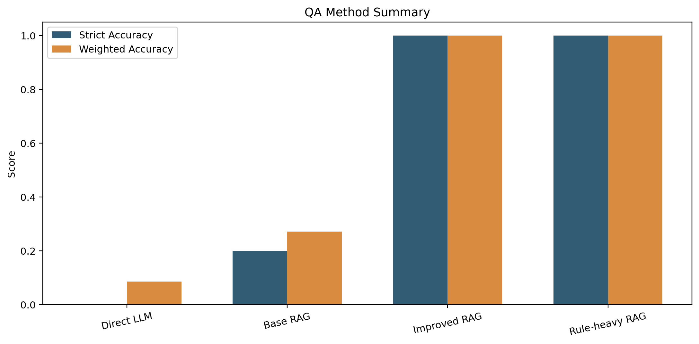
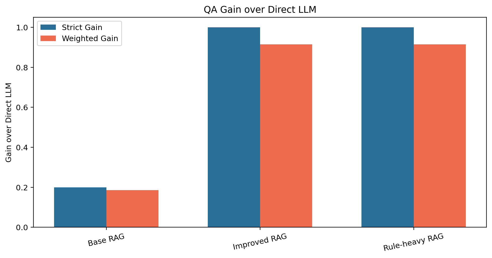
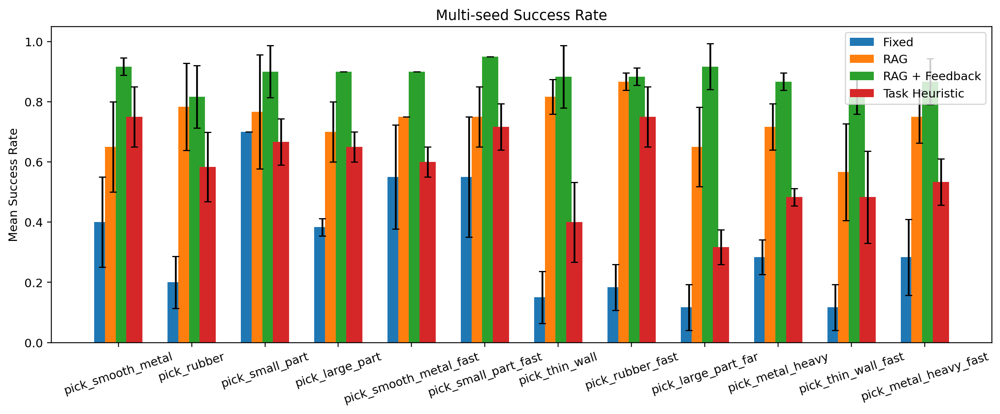
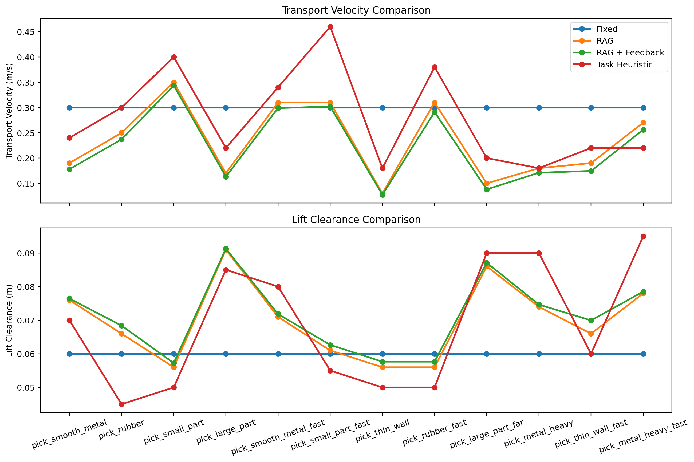
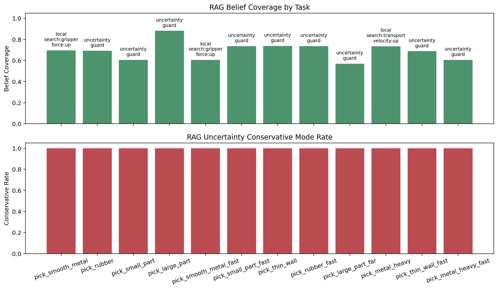
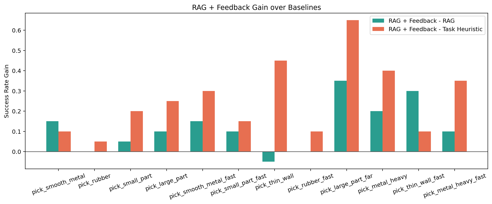

# MechanicalRag

面向机械工程与具身智能场景的知识增强问答与抓取仿真项目。

这个仓库现在按“核心代码 / 文档 / 输出 / 归档”分层组织，主线是两个问题：

1. 给定机械知识库与问题描述，系统能否稳定检索证据并在证据约束下回答问题。
2. 给定机械知识库与抓取任务描述，系统能否产出可执行控制参数，并在独立仿真环境中接受验证。

## 当前状态

截至 `2026-04-27 UTC`，当前仓库代码语义对应 `outputs/current_observer_step_replan/` 这次 phase-observation / suffix-counterfactual-repair 闭环验证；`outputs/current/` 继续保留为 `round19` 历史基线，`outputs/current_round20_sim/` 保留 `round20` 的 placement-stage 实验。

- 最新闭环结果目录：`outputs/current_observer_step_replan/`
- `round19` 历史基线：`outputs/current/`
- `round20` placement-stage 实验：`outputs/current_round20_sim/`
- QA 当前有效输出仍在 `outputs/current/qa_evaluation_detail.json`
- 当前仿真主链已经改成 `evidence -> belief -> seed synthesize -> local solve -> phase observation -> posterior update -> suffix repair`
- `observer_trace` 现在只是兼容字段；主执行日志是 `phase_execution_trace`、`observation_trace`、`belief_update_trace`、`counterfactual_replan_trace`
- `control_core.py` 现在负责 belief 直驱的 `belief_constraint_synthesis` seed，不再把旧 `_aggregate_plan` 当成最终控制计划
- 当前关键结果：
  - `rag_feedback` 12 任务多 seed平均成功率 `0.8847`
  - 相对当前 `rag` seed-only 路径，`rag_feedback` 多 seed平均成功率提升 `+0.1542`
  - `pick_metal_heavy = 86.67% ± 2.89%`
  - `pick_metal_heavy_fast = 86.67% ± 7.64%`
  - `pick_large_part_far = 91.67% ± 7.64%`
  - `pick_thin_wall_fast = 81.67% ± 5.77%`
  - `pick_smooth_metal_fast = 90.00% ± 0.00%`
- 当前重载验收口径已满足：
  - `pick_metal_heavy >= 0.30`
  - `pick_metal_heavy_fast` 绝对成功率下降不超过 `0.05`
  - 12 任务总体平均成功率不低于旧基线 `0.8222 - 0.01`
- `rag_feedback` 的执行内重规划现在使用 `suffix_counterfactual_replan`；post-failure retry 仍保留为兜底，但已经不是主修复语义
- `simulation_benchmark_result.json`、`simulation_comparison_rag_vs_baseline.json`、`simulation_comparison_multi_seed.json` 都已切到 Schema V2：主 summary 在 `methods.<method>` 下，控制计划看 `seed_plan` 和 `executed_plan_stats`
- `simulation_benchmark_trial_records.json` 提供逐 task / 逐 seed 的 execution log；单条 trial 会保留 `terminal_plan`、`observer_trace`、`phase_execution_trace`、`observation_trace`、`belief_update_trace` 和 `counterfactual_replan_trace`

如果只想看最新有效状态，优先看：

- [docs/overview.md](docs/overview.md)
- [simulation/README.md](simulation/README.md)
- [simulation_benchmark_result.json](outputs/current_observer_step_replan/simulation_benchmark_result.json)
- [simulation_benchmark_trial_records.json](outputs/current_observer_step_replan/simulation_benchmark_trial_records.json)
- [simulation_comparison_rag_vs_baseline.json](outputs/current_observer_step_replan/simulation_comparison_rag_vs_baseline.json)
- [simulation_comparison_multi_seed.json](outputs/current_observer_step_replan/simulation_comparison_multi_seed.json)
- [showcase_summary.txt](outputs/current_observer_step_replan/showcase_summary.txt)

## 迭代说明

本项目的完善过程按轮次持续推进。可以分成四段看：

### 基础阶段

- `round2-round5`：完成 QA 评测口径和 simulation 对比口径的基础建设，补齐混合评分、unsupported / abstain、counterfactual 证据依赖评测、扩 benchmark 任务集、`challenge_tags`、独立 learned baseline、结构化 evidence trace、evidence ablation 与 motion ablation。
- `round6-round7`：继续处理重载高速 motion 聚合和复杂任务检索优先级，让 `高速/长距离` 相关证据更稳定地进入检索结果。

### 定向补强阶段

- `round8`：首次联合补强 `pick_smooth_metal_fast` 和 `pick_large_part_far`，确认“夹持力上限 + 长距离搬运净空 + 运动相关力值补偿”这条方向。
- `round9`：集中处理 `pick_thin_wall`，解决夹持力偏低和支撑语义映射问题。
- `round10`：集中处理低速材料带宽问题，把 `pick_rubber` 和 `pick_smooth_metal` 都拉到 `81.67%` 左右。
- `round11-round12`：继续补动态力值中心校准和大件任务对象特定证据，让 `pick_large_part_far` 开始稳定命中 large-part force evidence。

### 长距离搬运主线

- `round13`：把长距离搬运里的数值运动条目落成可执行计划，环境侧加入 `transfer_sway_risk`。
- `round14`：为 `pick_large_part_far` 建立分阶段失败模型，失败桶拆成 `lift_hold_fail / transfer_sway_fail / placement_settle_fail`。
- `round15`：补显式 `placement_velocity`，把末段落位速度从隐含变量变成可见控制项。
- `round16`：补高速低摩擦运输模式，`pick_smooth_metal_fast` 提升到 `81.67% ± 2.89%`。
- `round17`：补显式 `transfer_alignment`，`pick_large_part_far` 提升到 `63.33% ± 7.64%`。
- `round18`：验证 `clearance window` 方向。局部 sweep 有改善，正式 multi-seed benchmark 未超过上一轮。
- `round19`：补显式 `lift_force`，`pick_large_part_far` 提升到 `65.00% ± 13.23%`，形成 `outputs/current/` 这条历史主线。
- `round20`：继续处理 `pick_large_part_far` 的 `placement_settle`，新增 placement-stage `placement_precision` 实验链。`placement_settle_risk` 有下降，但总体成功率回落到 `0.5833 ± 0.0577`。

### Phase Observation / Suffix Repair 闭环

- `2026-04-27 observer-step-replan`：在 `round19 / round20` 和前一版 thickening 之后，把控制链继续前推成 `evidence -> belief -> seed synthesize -> local solve -> phase observation -> posterior update -> suffix repair`。
- `simulation/control_core.py` 新增 belief 直驱的 `belief_constraint_synthesis` seed；`solver` 的 base candidate 不再表达成旧 `rule_aggregate` 主导。
- `simulation/env.py` 现在同时输出兼容 `observer_trace` 和主执行日志 `phase_execution_trace / observation_trace / belief_update_trace / counterfactual_replan_trace`。
- `simulation/runner.py` 与 `rag_feedback` 主链接入 `suffix_counterfactual_replan`；trial 级 retry 仍保留为兜底，但已经不再承担主修复职责。
- 这轮闭环结果落在 `outputs/current_observer_step_replan/`：`pick_large_part_far = 91.67% ± 7.64%`，`pick_thin_wall_fast = 81.67% ± 5.77%`，`pick_metal_heavy = 86.67% ± 2.89%`，`pick_metal_heavy_fast = 86.67% ± 7.64%`；当前重载验收门槛已经全部满足。

### 轮次索引

| 轮次 | 主要处理内容 | 结果 |
| --- | --- | --- |
| round2 | 补 QA 混合评分、扩 benchmark 任务集、引入独立 learned baseline | 建立后续评测与对比口径 |
| round3 | 补 unsupported / abstain 评测，加入结构化 evidence trace | QA 和控制链开始能解释“为什么答、为什么这样控” |
| round4 | 补 counterfactual QA 与 simulation evidence ablation | 证据依赖关系开始可验证 |
| round5 | 修残余 QA 误判，补 motion ablation | 基础评测链更加完整 |
| round6 | 定向处理 `pick_metal_heavy_fast` 的 motion 失配 | 避免过高净空和路径长度把力值需求抬高 |
| round7 | 修 query 扩展截断问题 | `高速/长距离` 证据更稳定地进入检索结果 |
| round8 | 首次联合补强 `pick_smooth_metal_fast` 和 `pick_large_part_far` | 两个核心场景都出现第一轮稳定提升 |
| round9 | 集中处理 `pick_thin_wall` | 成功率从 `36.67% ± 11.55%` 提升到 `73.33% ± 5.77%` |
| round10 | 集中处理 `pick_rubber` 和 `pick_smooth_metal` | 两个低速材料任务都提升到 `81.67%` 左右 |
| round11 | 做动态力值中心校准 | 高负载和高速场景的力值中心更合理 |
| round12 | 补大型零件对象特定证据 | `pick_large_part_far` 开始稳定命中大型零件对应的力值证据 |
| round13 | 把长距离搬运数值条目转成可执行计划 | 新增 `transfer_sway_risk`，开始显式建模长距离搬运风险 |
| round14 | 建立分阶段失败模型 | 失败桶拆成 `lift_hold`、`transfer_sway`、`placement_settle` |
| round15 | 补显式 `placement_velocity` | 末段落位从隐含行为变成可见控制项 |
| round16 | 补高速低摩擦运输模式 | `pick_smooth_metal_fast` 提升到 `81.67% ± 2.89%` |
| round17 | 补显式 `transfer_alignment` | `pick_large_part_far` 提升到 `63.33% ± 7.64%` |
| round18 | 验证 `clearance window` | 正式 multi-seed 未超过 `round17` |
| round19 | 补显式 `lift_force` | `pick_large_part_far` 提升到 `65.00% ± 13.23%`，形成历史主线 |
| round20 | 实验 `placement_precision` | `placement_settle_risk` 下降，但总成功率回落到 `0.5833 ± 0.0577` |
| 2026-04-27 thickening | 引入 belief / uncertainty / solver 控制核 | 保住两项核心动态任务，平均 `+0.0014`，但 `pick_smooth_metal` / `pick_metal_heavy` 回落 |

## 主入口

- 综合说明：[docs/overview.md](docs/overview.md)
- 设计文档：[docs/DESIGN.md](docs/DESIGN.md)
- 仿真说明：[simulation/README.md](simulation/README.md)
- 一键运行：`bash scripts/run_all.sh`

## 当前结构

```text
MechanicalRag/
├── README.md
├── requirements.txt
├── mechanical_data.txt
├── chroma_compat.py
├── llm_loader.py
├── model_provider.py
├── qa/
├── simulation/
├── reporting/
├── scripts/
├── docs/
├── outputs/
└── archive/
```

目录职责：

- `qa/`：统一 QA 内核、数据集与评测。
- `simulation/`：controller、`control_core`、environment、runner、CLI。
- `reporting/`：图表与摘要生成。
- `scripts/`：环境测试、模型下载、一键运行脚本。
- `outputs/`：当前运行结果与图表。
- `archive/`：历史复现快照与旧文档。

## 环境准备

```bash
python -m venv venv --system-site-packages
source venv/bin/activate
pip install -r requirements.txt
python scripts/download_models.py
python scripts/env_test.py
```

当前默认模型：

- 生成模型：`Qwen/Qwen2-0.5B-Instruct`
- 向量模型：`sentence-transformers/all-MiniLM-L6-v2`

## 运行方式

完整流程：

```bash
bash scripts/run_all.sh
```

当前文档对应的复现实验：

```bash
source venv/bin/activate
python -m qa.evaluation --data_path mechanical_data.txt --case_set full --output_dir outputs/current
python -m simulation.benchmark --report_multi_seed --method rag_feedback --n_trials 20 --seeds 42 43 44 --output outputs/current_observer_step_replan/simulation_benchmark_result.json
python -m simulation.benchmark --compare_feedback --n_trials 20 --seed 42 --output_dir outputs/current_observer_step_replan
python -m simulation.benchmark --compare_evidence_ablation --n_trials 20 --seeds 42 43 44 --output_dir outputs/current
python -m simulation.benchmark --compare_motion_ablation --n_trials 20 --seeds 42 43 44 --output_dir outputs/current
python -m simulation.benchmark --compare_multi_seed --n_trials 20 --seeds 42 43 44 --multi_seed_methods rag rag_feedback task_heuristic fixed --output_dir outputs/current_observer_step_replan
python reporting/visualize_results.py --qa_json outputs/current/qa_evaluation_detail.json --sim_json outputs/current_observer_step_replan/simulation_comparison_rag_vs_baseline.json --sim_multi_seed_json outputs/current_observer_step_replan/simulation_comparison_multi_seed.json --output_dir outputs/current_observer_step_replan/visualizations
python reporting/generate_showcase.py --qa_json outputs/current/qa_evaluation_detail.json --sim_json outputs/current_observer_step_replan/simulation_comparison_rag_vs_baseline.json --sim_multi_seed_json outputs/current_observer_step_replan/simulation_comparison_multi_seed.json --sim_benchmark_json outputs/current_observer_step_replan/simulation_benchmark_result.json --output outputs/current_observer_step_replan/showcase_summary.txt
```

## 关键输出

- QA：
  - `outputs/current/qa_evaluation_detail.json`
  - `outputs/current/rag_evaluation_report.txt`
  - `outputs/current/problem_solving_result.txt`
- 最新 observer / step-replan 结果：
  - `outputs/current_observer_step_replan/simulation_benchmark_result.json`
  - `outputs/current_observer_step_replan/simulation_benchmark_trial_records.json`
  - `outputs/current_observer_step_replan/simulation_comparison_rag_vs_baseline.json`
  - `outputs/current_observer_step_replan/simulation_comparison_multi_seed.json`
  - `outputs/current_observer_step_replan/showcase_summary.txt`
  - `outputs/current_observer_step_replan/visualizations/`
- `round19` 历史基线：
  - `outputs/current/simulation_benchmark_result.json`
  - `outputs/current/showcase_summary.txt`
- `round20` placement-stage 实验：
  - `outputs/current_round20_sim/simulation_benchmark_result.json`
  - `outputs/current_round20_sim/showcase_summary.txt`
- 历史消融：
  - `outputs/current/simulation_evidence_ablation.json`
  - `outputs/current/simulation_motion_ablation.json`
  - `outputs/current/simulation_split_summary.txt`
  - `outputs/current/simulation_challenge_summary.txt`

## 结果图示

下面的图直接引用 `outputs/current_observer_step_replan/visualizations/` 中已经生成的结果图。

QA 方法汇总：

这张图汇总了各个 QA 方法在当前评测集上的整体表现，适合先看方法之间的总体差距。



QA 相对 Direct LLM 的增益：

这张图把各个 QA 方法相对 `Direct LLM` 的提升单独拉出来展示，便于看增益是否稳定。



Simulation 多 seed 成功率：

这张图展示仿真 benchmark 在多 seed 设置下的成功率分布，是当前 observer / step-replan 闭环最直接的图形摘要。



Simulation 控制计划对比：

这张图对比不同任务上的控制计划参数，包括夹持力、运输速度、末段落位速度和抬升净空。



Simulation belief / solver 诊断：

这张图聚焦 belief coverage、conservative mode 和 solver 选择，适合判断当前 seed synthesize / local solve 链是否真的脱离了旧规则后处理。



Simulation 成功率增益：

这张图展示 RAG 控制器相对基线方法的成功率提升，适合配合 benchmark JSON 一起看。



## 对比口径

- QA 评测统一运行在同一知识库、同一 split 和同一评分规则上，并输出词面命中、语义相似、数值一致性、流程顺序、拒答行为与证据命中分离统计。
- simulation 对比统一使用同一任务集、同一 trial / seed 预算和同一环境判定逻辑；`reference_force_range` 只用于结果分析，不会作为控制器输入。
- simulation 当前比较的是八参数控制计划：`gripper_force`、`lift_force`、`transfer_force`、`transfer_alignment`、`approach_height`、`transport_velocity`、`placement_velocity`、`lift_clearance`。
- `simulation_benchmark_result.json`、`simulation_comparison_rag_vs_baseline.json`、`simulation_comparison_multi_seed.json` 当前都使用 Schema V2：`methods.<method>.seed_plan` 表示初始 planner proposal，`methods.<method>.executed_plan_stats` 表示 task 级 terminal-plan 聚合，`methods.<method>.planner_diagnostics` 保存 belief / solver 统计。
- `simulation_benchmark_trial_records.json` 是配套明细文件；逐 task 汇总 `trial_records`，并保留每个 seed 的 `seed_plan`、`planner_diagnostics` 与 trial 级 `observer_trace / phase_execution_trace / observation_trace / belief_update_trace / counterfactual_replan_trace`。
- simulation 当前会输出 belief / uncertainty / solver 诊断，以及 `phase_execution_trace / observation_trace / belief_update_trace / counterfactual_replan_trace`；其中 observation / posterior 仍是轻量执行期估计与局部修正日志，不应被解读成完整后验滤波或优化规划日志。
- simulation 结果除成功率外还输出 95% CI、多 seed `mean±std`、按 `train/val/test` 聚合的 split 汇总、按 `challenge_tags` 聚合的 challenge 汇总、证据支持度/冲突统计、距离误差与稳定度/速度/净空风险指标。
- simulation 额外提供 `rag` 对 `rag_generic_only` 的 evidence ablation，以及 `rag` 对 `rag_no_motion_rules` 的 motion ablation，用于验证增益来源。

## 当前限制

- QA 结果应解释为“当前知识库 + 当前 split 划分”上的结果，而不是开放域强泛化证明。
- QA 当前包含 `ood` 与 `counterfactual` split；其中 `counterfactual` 是条目级证据移除评测，能证明源依赖，但仍不等同于真实开放环境下的文档缺失分布。
- 仿真 benchmark 的成功判定已基于物体属性和执行观测独立建模；`reference_force_range` 只保留为分析指标，不再参与环境判定。
- `rag_learned` 现在使用环境 teacher 标签而不是 RAG 银标，但仍然只是轻量学习基线，不代表完整学习控制器。
- simulation evidence ablation 目前只覆盖对象特定 force rule，对更细粒度的运动学 / 接触规则删减实验仍未展开。
- 当前仓库代码语义以 `outputs/current_observer_step_replan/` 为准；`outputs/current/round19` 继续保留为历史基线，`outputs/current_round20_sim/` 保留 placement-stage `placement_precision` 实验。
- `rag_feedback` 当前已经补上 phase observation 和 suffix counterfactual replan，但 observation / posterior 仍是轻量执行期估计器，不是完整 posterior filter。
- `belief_state` 仍然首先从知识证据长出来，执行期观测主要进入 feedback replan，而不是从头替代 retrieval-belief 这条前置链。
- 当前最明显的剩余缺口已经不再是 `pick_metal_heavy`，而是如何把 `phase observation -> posterior update -> suffix repair` 从轻量局部修正继续推进到更强的后验滤波 / 规划语义。
- 新增的多阶段控制计划仍是简化控制抽象，不等价于完整机器人轨迹优化与接触控制栈。

## 备注

- 若需要回退到 Hugging Face，可设置 `MODEL_PROVIDER=huggingface`。
- 若本机没有 MuJoCo，`simulation.benchmark` 会回退到环境代理模型，流程仍可执行。
